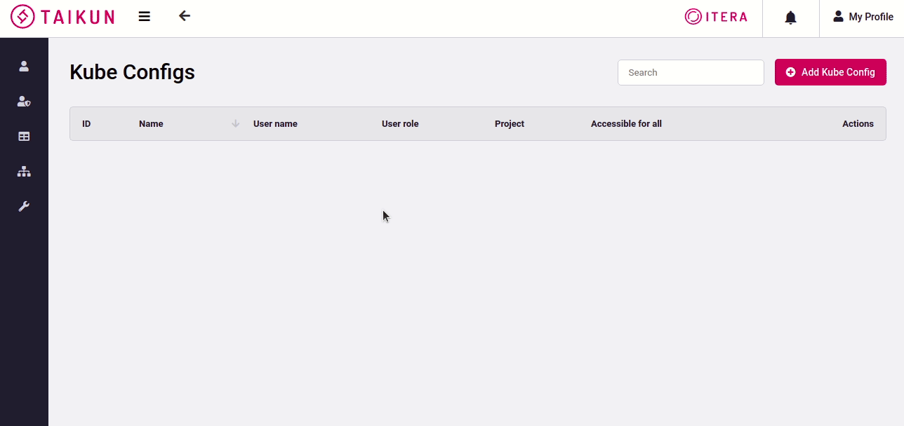
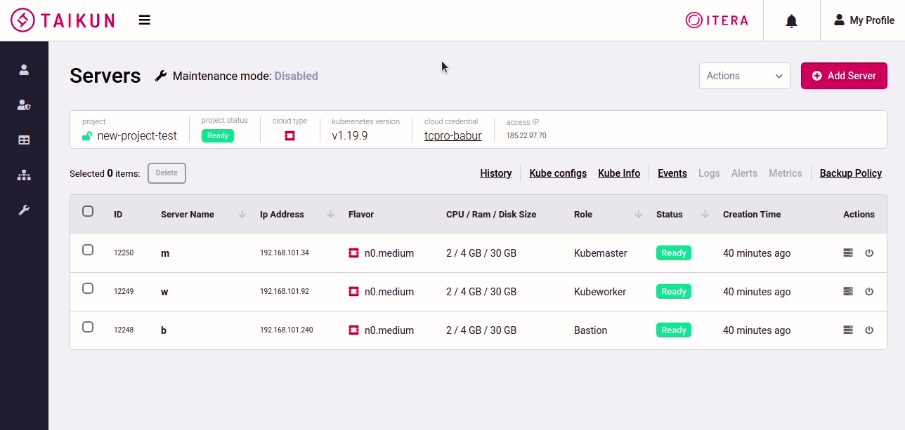

# Kubeconfigs, Backup, Monitoring, Lock, Reboot

## Kubeconfigs

Create and download kuberenetes configuration to organize information about clusters, users, namespaces, and authentication mechanisms.


Manager/Partner: You can see and delete other user's kube configs, but you cannot use them for connecting, if the kubeconfig is not for everyone.\
User: You can use and delete only your kube config.


See info for [User](https://itera.gitbook.io/taikun/user-guide-1/user/projects/project-details#kube-configs), [Manager](https://itera.gitbook.io/taikun/user-guide-1/manager/projects/project-details#kubeconfigs) and [Partner](https://itera.gitbook.io/taikun/user-guide-1/partner/projects/project-details#kubeconfig).


The following features are only for Manager and Partner.


## Enable/Disable Backup

1\) If you want to have a backup, first you must add Backup credentials:

Fill all fields for S3 credentials and add connect them with add button.

.png>)

2\) Enable backup.

a) You can enable backup during creation.

.gif>)

b) Backup can be enabled also after the project is created.

First you have to enable back and then choose credentials.

4\) After you enabled backup, you must set up backup policy

.gif>)


Once the policy is add, the cronjob starts.


More info for [Manager](https://itera.gitbook.io/taikun/user-guide-1/manager/projects/project-details#backup-policy) and [Partner](https://itera.gitbook.io/taikun/user-guide-1/partner/projects/project-details#backup-policy).

5\) To terminate the backup, delete the policy.

6\) If you no longer want to use back, disable it&#x20;

## Enable/Disable Monitoring

1\) Enable monitoring during creation of the project.

2\) Or you can enable monitoring after you create the project.

The process takes up to 2 minutes and if successful, _Logs, Alerts_ and _Metrics_ are enabled.

3\) Disable Monitoring the same way.

.gif>)

## Lock/Unlock

If Manager/Partner lock the project, you can only preview some pages but you can't make any changes (actions).

You can see if the project is.png>)unlock or.png>)locked in project info:

or in Project overview:

## Reboot

You can reboot servers directly from Taikun.

For Openstack you can choose HARD or SOFT reboot for each server.

For AWS and Azure there is only simple reboot available.

.gif>)

For more info see

* User - [Project Details](https://itera.gitbook.io/taikun/user-guide-1/user/projects/project-details)
* Manager - [Project Details](https://itera.gitbook.io/taikun/user-guide-1/manager/projects/project-details)
* Partner - [Project Details](https://itera.gitbook.io/taikun/user-guide-1/partner/projects/project-details)
