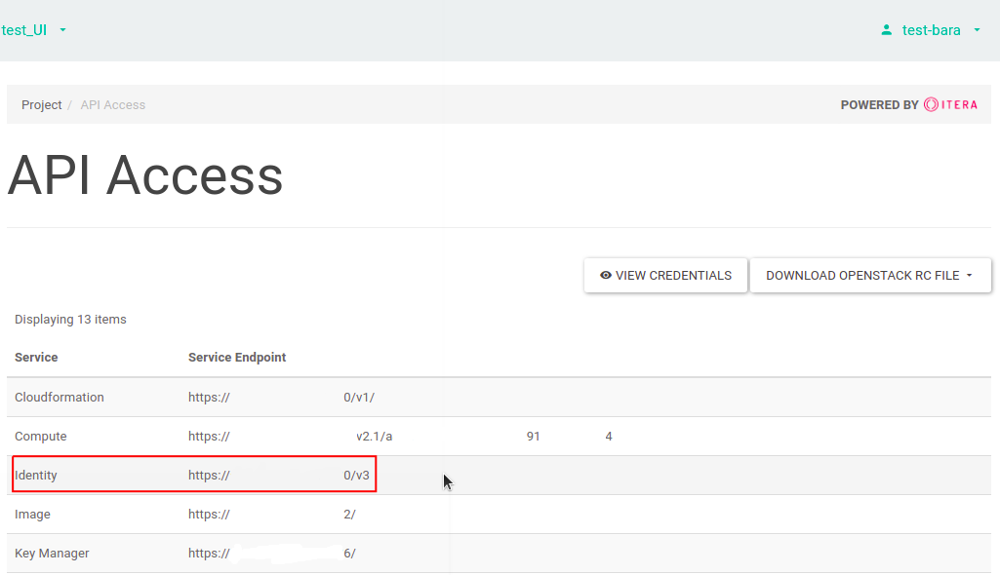
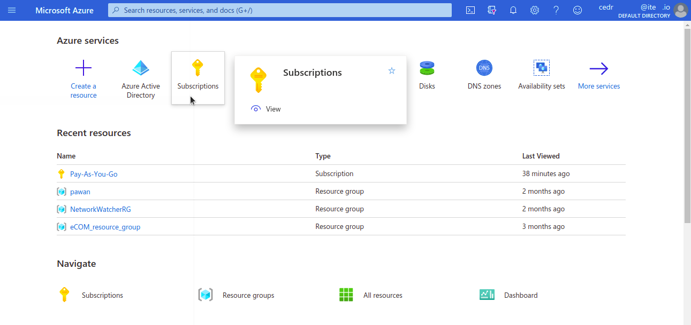

# Where to find credentials

## Openstack

As you should know your _user name_ and _password_, after filling the _url_, the other data from Openstack will be seen right in Taikun.

Url

* Api Access - Identity (=Url)

## AWS

In AWS console, click _My Security Credentials_ under your user. Here you can create a new access key with secret key or you can use your previous one, if you remember the secret key. See docs below.

Access Key Id, Secret Access Key

* User - My Security Credentials - Access keys for CLI, SDK, & API access

[AWS documentation](https://aws.amazon.com/blogs/security/wheres-my-secret-access-key/)

## Azure

If you haven't create you application via CLI, find the right guideline [here](https://itera.gitbook.io/taikun/guidelines/create-credentials#azure).

Credentials for Azure are in different tabs. Find below where to find them. If you haven't paid your subscription or created secret, find the docs at the end.

Please be careful when inserting the credentials. If you add incorrect credentials, you will not be able to add flavor and then create cluster.

### Azure Client and Tenant Id

* Azure Active Directory - App registrations - All Applications - _application_ -> Application (client) ID (=Azure Client Id) and Directory (tenant) ID (Azure Tenant Id)

### Azure Secret Id

* Azure Active Directory - App registrations - All Applications - _application_ - Certificates & secrets - Client secrets -> Value (=Azure Secret Id)


Client Secret is shown only for the first time, we recommend to save it somewhere else.


### Azure Subscription Id

* Subscriptions -> Subscription ID (=Azure Subscription Id)

[Azure guideline](https://www.inkoop.io/blog/how-to-get-azure-api-credentials/)
