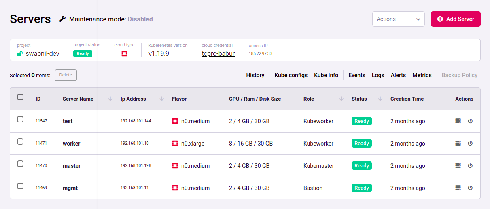

# Creating a Cluster

If you have connected your cloud, you can create a new project.

1\) Manager/Partner has to create [a new project](https://itera.gitbook.io/taikun/user-guide-1/manager/projects/creating-a-new-project) and [assign](https://itera.gitbook.io/taikun/user-guide-1/manager/projects#assigned-users) it to a user.

.gif>)


Keep in mind you have to add profiles during project creation otherwise you cannot do it later.


2\) Manager/Partner [binds flavors](https://itera.gitbook.io/taikun/user-guide-1/manager/flavor-info#bind-to-project) needed to the new project.

a) during project creation

b) in Flavor Info


For a well-functioning cluster you should **NOT** use small flavors.


3\) Now User/Manager/Partner can create new servers in the project. Keep in mind, that a working cluster consists at least of 1 Bastion, 1 Kubemaster and 1 Kubeworker. However, you can also create a multimaster by creating more than 1 Kubemaster, the number of masters must be odd. If you want to create a multimaster, you have to do it before commit.


Recommendation for sizing:

* _bastion_ recommended 2 vCPU + 2GB of RAM
* _masters_ recommended 4 vCPU + 8GB of RAM


* add servers (more info for [User](https://itera.gitbook.io/taikun/user-guide-1/user/projects/project-details), [Manager](https://itera.gitbook.io/taikun/user-guide-1/manager/projects/project-details) and [Partner](https://itera.gitbook.io/taikun/user-guide-1/partner/projects/project-details))

.gif>)

* use shortcuts:
  * b - bastion
  * m - master
  * w - worker
  * numbers of master/worker for faster server addition&#x20;


The bigger flavor you choose the longer it will take to create.


* commit


Control if you have all servers you need, the creation can take some time (approx. 7 min per server).

User: Also double check if you need all of them because later you won't be able to delete them.


.gif>)

* creating the project, servers get through the stages:
  * ->->

&#x20;

* successful creation, the project is _Ready_

* failed creation, the project is _Failed_ or _Pending_ without any action
  * if servers fail during creation, best way to restore them is with repair button (details: [User](https://itera.gitbook.io/taikun/user-guide-1/user/projects/project-details#repair), [Manager](https://itera.gitbook.io/taikun/user-guide-1/manager/projects/project-details#repair), [Partner](https://itera.gitbook.io/taikun/user-guide-1/partner/projects/project-details#repair))

* delete servers
  * Manager/Partner can delete unnecessary servers


You can delete servers to still have working cluster (1 bastion, 1 master and 1 worker) or delete the whole working cluster.


4\) Control remotely.

Use [kubeconfig](https://itera.gitbook.io/taikun/guidelines/backup-monitoring-lock-reboot#kube-configs) file to connect to your kubernetes.


Please do NOT deploy any apps in monitoring **Service**, because Taikun uses the monitoring namespace heavily! And if you disable the monitoring, all pvc in monitoring will be deleted.

