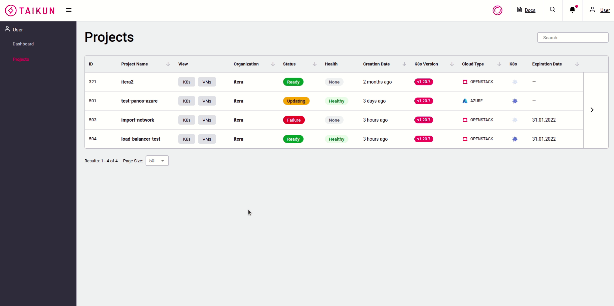
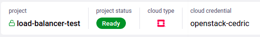
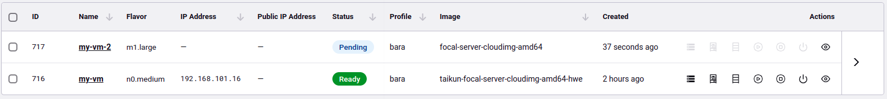
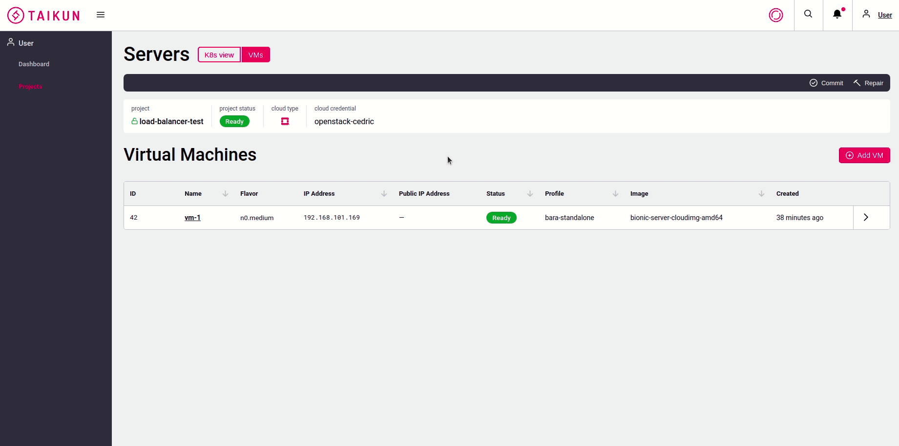

# Project Details - VMs

By clicking _VMs_ button in Servers page or VMs _View_ in Project page you are redirected to the **VMs** **Servers**. Here you can see all virtual machines for the project with their description.

### Project Info

Under **Servers** title is a brief description of the project - such as _Project Name ****_ (with locked/unlocked image), _Project_ _Status_, _Cloud_ _Type_ or _Cloud_ _Credentials_.

When there is some operation going on, you can also see here ETC=Estimated Time to Complete. It is approx time (in minutes) until the cluster will be completed.

### Servers

Every Server is described by _ID_, _Name_, _Flavor_, _IP Address_, _Public IP Address_, _Status_, _Profile_, _Image_ and _Created_. If you expand the table, you can see the last modification made (_Created By_, _Last Modified_, _Last Modified By_).

Server status can be:

* Deleting
* Failure
* Pending
* Pending Delete
* Pending Upgrade
* Ready
* Updating
* Upgrading

#### Actions

### Commit

Sends the changes to the repository.

Once the cluster is committed you will see **ETC** in project info.

### Repair

When the server/s are _Failed,_ use repair button.

.gif>)

### Add VM

To create a new server clickbutton and fill all the fields. You, as user, can't delete servers - think twice which and how many servers you want to create.


For creating the VM: _**Image**_ has to be bound and _**Stanalone Profile**_ has to be created. Please contact your manager if these are empty.


_Server Name_ - only alphanumeric characters and dash are allowed, 1-30 characters


Letters must be lowercase!


_Flavor_ - choose from the list of offered flavors (e.g. n0.large)

_Image_ - choose from the list of offered images (e.g. ubuntu-20.04)

_Volume Size_ - minimal size is automatically filled in when you select _image_, you can only increase the volume size number

_Volume Type_ - optional, choose from drop down selection

_Profile_ - choose _Standalone profile_

_Count_ - how many VMs you want to create

_Public IP_ - check if you want to enable public IP

_Cloud-init_ - optional, if set it will override the ssh key from standalone profile

_Tags_ - enter _Key_ and _Value_

_Disks_ - enter _Name_, choose _Size_ and select _Volume Type_


If the project is locked:lock:, you **can't** use _Commit_, _Repair_ or _Add VM_.


