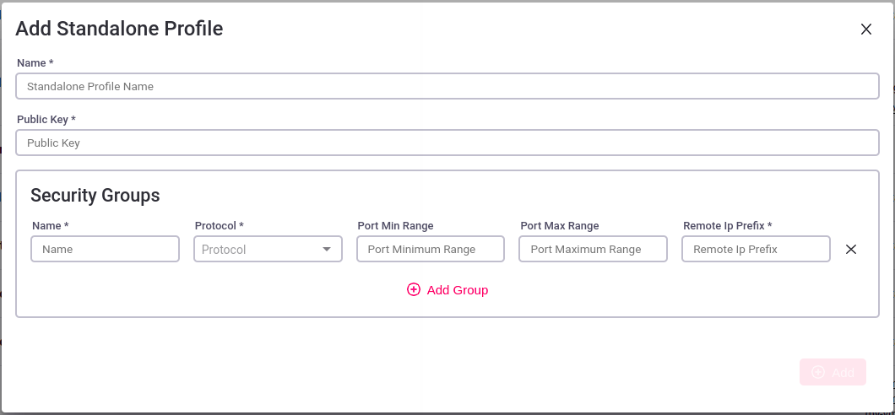

# Standalone Profiles


You **cannot** add a new _VM_ without any _standalone profile_, please create a new one first.


See all profiles created for your organization. Each profile is described by its _ID_, _Name_, _Public Key_, _Security Group_ (redirects to another page) and to which _VM_ _the profile is associated_.

.png>)

#### Actions

​/​Un/lock profile - if you lock your profile, you can't use it for VM, edit or delete it

​Update profile - update policy profile

​​Delete - delete non-used and unlocked profiles

### Add Standalone Profile

Create a new profile to access your virtual machine.

_Name_ - choose name for your profile

_Public Key_ - insert your SSH public key to access the VM

_Security Groups_ - optional, protocols **ICMP**, **TCP** and **UDP** are supported


Once the _profile_ is created _SSH key_ **cannot** be edited.

