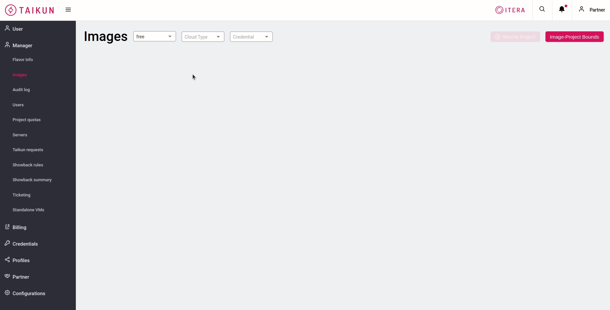

# Images


To use a _images_ for VMs in the project, you have to **bind the image to the project first**.


### Bind to Project

Choose _Organization_, _Cloud Type_ and _Credentials_ where your project is stored, then choose from drop down selection other criteria if needed. After selecting image/s you can bind it/them to the project.

An error message is displayed, if the _image_ is already bound to the project.

### Image-Project Bounds/Unbind Image

To overview all _images_ used in Projects usebutton. Flavors for each _Cloud_ (Amazon, Azure, OpenStack) can be sorted by _Name_, _Project Name_ and _Size_.

To unbind a flavor from a specific project, choose a Cloud, select the project-image bound and usebutton.

