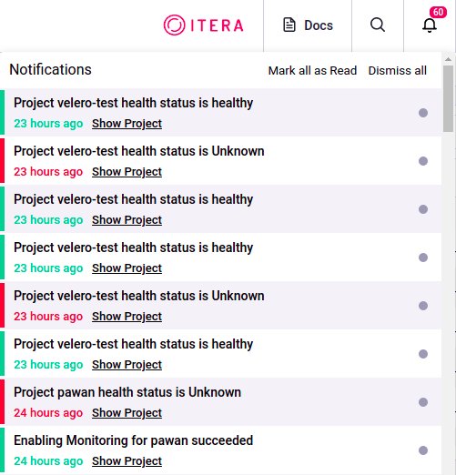

# Tables

### Kubernetes

The **Kubernetes** chart consists of 3 main sections:

* Project
* Nodes
* Pods

.gif>)

**Projects**

In the right corner you can switch between **Projects** with Kubernetes (to which you are assigned to).

**Nodes**

Lists Nodes by _Name_ and shows status of _Disk_, _Memory_, _PIDs_ and _Ready_ (Status of the Node).

**Pods**

For every **Pod** (characterized by _Pod Name_) is listed its _Namespace_, _Node_, _Restart_ _Count_, _Age_ and _Status_.

If the status is failed, you can check the pod in Kubernetes section - use the link in _Nodes - Metadata Name_ or _Pods - Pod Name_.

For more information see [Projects - **Kubernetes**](https://itera.gitbook.io/taikun/user-guide-1/user/projects/kubernetes).

### Project Resource Allocation

In this section you can see how the usage of _CPUs_, _RAM_ and _Disk_ _Size_ are divided between the individual projects. The last column _Total_ shows the sum of all projects for _CPU_, _RAM_ or _Disk Size_. You can also sort _CPU_, _RAM_ and _Disk Size_  by _Usage_ or _Limit_ (if there is any).

The pie charts shows percentage of usage of each project:

.png>)

### Recent Events

Lists 10 events from the latest. Green ones are successful events, red ones are failed. The update button is in the right corner.


If there is a real-time change, you are notified through **Notifications** :bell:.&#x20;


#### Notifications

Whenever user makes a change (create project, add backup, delete project etc.) you are notified via bell:bell:at the top of a page.

The colors indicate:

* green - successful action
* red - failed action

The notification contains a brief message on a specific project and bellow the message is time of the change. After clicking **Show Project**, you will access the project in which the change was made.

As the name suggests: _Mark as Read_ and _Dismiss all_.
