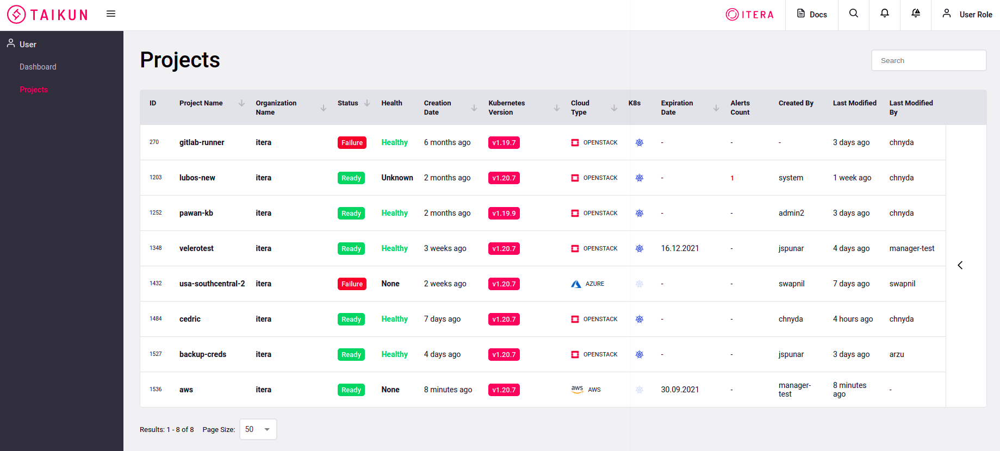

# Projects

On the **Projects** tab, you can preview all existing projects to which you are assigned.

.png>)

Each project is described by following information:

#### ID, Project Name, Organization Name

Changeless descriptions for each Project.

#### Status

Status shows the current status and actions of your servers in the project in real-time. Below are all possible statuses listed with their description.

* Ready
  * all servers in the project are ready without any issues
* Deleting
  * one or more servers in your current project are being deleted
* Failure
  * one or more servers failed during the action for any reason (for instance during boot or creation)
* Pending
  * one or more servers are in a pending state, which means that, for instance, they have not yet been created on the hosted platform
* Updating
  * one or more servers in the project are being updated by Taikun during the creation process
* Upgrading
  * one or more servers upgrade Kubernetes, cloud credentials or others

#### Health

This column describes a condition of the project cluster. Keep in mind that a good-working project should be always **Healthy.**

* Healthy
  * cluster id without any further problems
* None
  * cluster is probably empty, there is nothing to check
* Unhealthy
  * problems with connection to Kubernetes or Monitoring API
* Unknown
  * cannot connect Kubernetes API
* Warning
  * minor issues

&#x20;**Creation Date**

The exact time stamp when the project was created.

#### Kubernetes Version

Shows current Kubernetes version for each project.

#### Cloud Type

Shows which provider is hosting your project cluster

* AWS
* Azure
* OpenStack

#### K8's

Kubernates active

 Kubernetes not active

#### Expiration Date

See durability of a project. By default, the expiration date of project is set to infinity.


After the expiration date, your project is **NOT** affected, deleted or lock. It will stays the same.


#### Show hidden columns

Click small arrow on the right side of the table to see more details.

Expand the table to see:

* Alerts count - number of firing alerts in a project
* Created By
* Last Modified
* Last Modified By

### Sorting

Projects can be sorted by _Project Name, Organization Name_, _Status_, _Creation Date_, _Kubernetes version_ or _Cloud Type_. Also the search bar can be used to find some specific project.
