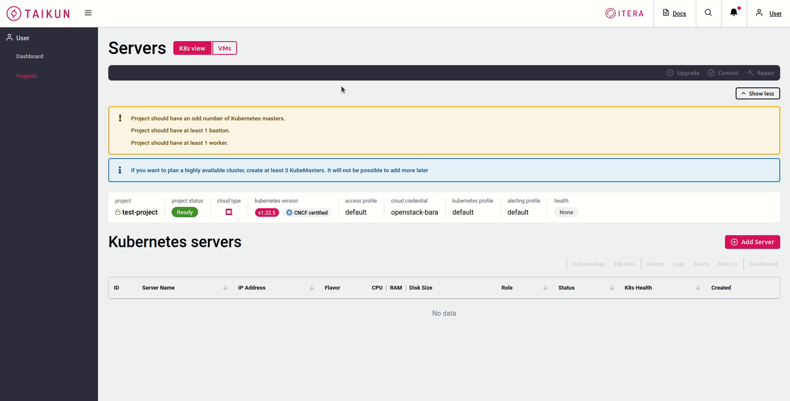
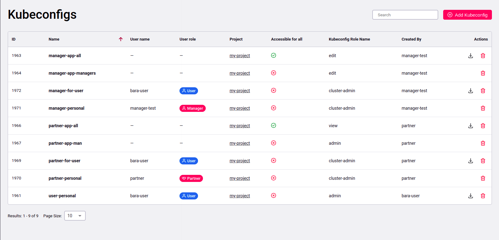

# Project Details - K8s

By clicking the selected project or K8s _View_ you are redirected to the **Kubernetes** **Servers**. Here you can see all K8s servers for the project with their description.

.gif>)

### Project Info

Under **Servers** title is a brief description of the project - such as _Project Name ****_ (with locked/unlocked image), _Project_ _Status_, _Cloud_ _Type_, _Kubernetes_ _Version_, _Access Profile_,  _Cloud_ _Credentials_, _Kubernetes_ _Profile_, _Alerting Profile_, _Policy Profile_, _Access IP Address_ (if you use this address to ssh connect, please do not use user ubuntu, it's in use by Taikun for managing the cluster) and _Kubernetes Health_.

You can also see here ETC=Estimated Time to Complete. It is approx time (in minutes) until the cluster will be completed.

### Servers

Every Server is described by _ID_, _Server Name_, _IP Address_, _Flavor_, _CPU/RAM/Disk Size_, _Role_, _Status_, _Kubernetes Health_ and _Creation Time_. If you expand the table, you can see the last modification made (_Created By_, _Last Modified_, _Last Modified By_).

.png>)

Server status can be:

* Deleting
* Failure
* Pending
* Pending Delete
* Pending Upgrade
* Ready
* Updating
* Upgrading

#### &#x20;**Actions**

### **Upgrade**

Upgrade your version of Kubespray to the latest one.

The button is disabled, if your Kubernetes are up to date. Also if there was chosen to _Auto Upgrade_ during creation.

### **Commit**

Sends the changes to the repository.

Once the cluster is committed you will see [**ETC**](https://itera.gitbook.io/taikun/user/projects/project-details#project-info) in project info.

### **Repair**

When the server/s are _Failed_ or there is some other problem in the cluster, use repair button.

.gif>)


If the project is locked:lock: (which you can see under [**Project Info**](https://itera.gitbook.io/taikun/user-guide-1/user/projects/project-details#project-info)), you can only preview some pages (e.g. _Kube Info_). You can't make any changes.


### **Add Server**

To create a new server click.png>)button and fill all the fields. You, as user, can't delete servers - think twice which and how many servers you want to create.

_Server Name_ - only alphanumeric characters and dash are allowed, 1-30 characters


Letters must be lowercase!


_Disk size_ - should be **at least** 30GB

_Role_ - you are able to choose from several roles for your servers, which are set according to the Kubernetes settings

_Number of Servers_ - set number for kubeworker or kubemaster, add odd number of masters (min. 3 for a highly available cluster)


The change **MUST** be committed.


_Flavor_ - choose from the list of offered flavors (e.g. n0.large)


Recommendation for sizing:

* _bastion_ recommended 2 vCPU + 2GB of RAM
* _masters_ recommended 4 vCPU + 8GB of RAM


_Kubernetes Node Labels_ - label nodes where you want to sent or restrict pods; you can add more labels with add label button, for more info see [Kubernetes docs](https://kubernetes.io/docs/concepts/overview/working-with-objects/labels/)

__

**Function buttons**

Between _Project Info_ and _Servers_ are buttons with specific features or more detailed information.

### Kubeconfigs

Add a new kubernetes configuration for your profile and project.

_Kubeconfig Name_ - choose a name for your kubeconfig (3-230 characters)

_Kubeconfig Role_

* admin - RoleBinding - allows read/write access to most resources in a namespace, does not allow write access to resource quota or to the namespace itself&#x20;
* edit - allows read/write access to most objects in a namespace, does not allow viewing or modifying roles or role bindings, allows accessing Secrets and running Pods as any ServiceAccount in the namespace
* view - see most objects in a namespace, does not allow viewing roles or role bindings, does not allow viewing Secrets


For more info, see[ kubernetes documentation](https://kubernetes.io/docs/reference/access-authn-authz/rbac/#user-facing-roles).


_Personal Kubeconfig_ - kubeconfig can be used only by you

__

You can see all project's configurations in the table with its _ID_, _Name_, _User_ _Name_, _User_ _Role_, _Project_, _Accessible for all_ and _Actions_.

#### Actions

This .yaml file can be download and use to organize information about clusters, users, namespaces, and authentication mechanisms.

.png>)Delete your kube config if it is no longer needed.

****

### **Kube Info**

If Kubernetes is active, Kube Info button will take you to the Kubernetes configuration. For more see [Projects - **Kubernetes**](https://itera.gitbook.io/taikun/user-guide-1/user/projects/kubernetes).

### ****

### **Events**

You are redirected to **** Events, where you can see all Kubernetes changes made in the project. To preview details for more information to each action usebutton. A green strip indicates a successful action, a red strip indicates a failed action. Use _Clear events_ for deleting all the events.

You can sort Events by:

* _Search_ field
* Filling _Start_ and _End Date_
* Tick _Only failed_ to filter failed actions

.png>)

### Logs

Preview Kubernetes cluster logs to Grafana.

Logs button is disabled if _Monitoring_ is disabled.

.png>)

Write your query and use _Start date_ and _End Date_ for sorting. You can also expand every message - red is added action, no color is other.

### Alerts

First thing when you access Alerts are _Firing Alerts_. This section is refreshed every 5 minutes, but you can also use the refresh button to see the most updated data.

To see all alerts, use upper right _Show All Alerts_ button. As seen above, firing alerts are marked with red color. For each alert you can see details and use a link that will redirected you to [**Metrics**](https://itera.gitbook.io/taikun/user-guide-1/user/projects/project-details#metrics) **** with the query already written.

Alerts are accessible only if _Monitoring_ is enabled and the project is not empty.

The index number at _Alerts_ shows the number of firing alerts.  When the firing alerts are resolved, the number disappears.

Firing alerts also work from the real-time notifications bell in the header. Red ones are indicate alert, green ones means that the alert is resolved.&#x20;

The notification contains a brief message on a specific project and bellow the message is time of the change. After clicking _Show Project_, you can access the project in which the alert is.

As the name suggests: _Mark as Read_ and _Dismiss all_.

### Metrics

Write a query, search Prometheus Metrics and preview the value needed.

Modify _Step_ or _Date_.

Switch between _Console_ and _Graph_ for better results.

.gif>)

### Project Dashboard

Dashboard is accessible only if cluster is created and monitoring is enabled.

.gif>)

Here you can see graphs with _Memory_ and _CPU_ usage for the project. You can also see added Query from [Manager](https://itera.gitbook.io/taikun/manager/projects/project-details#dashboard) or [Partner](https://itera.gitbook.io/taikun/partner/projects/project-details#dashboard).

